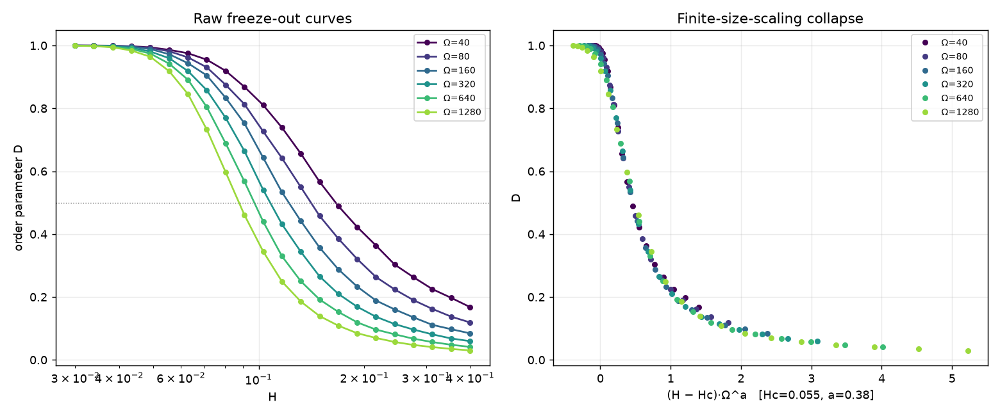

# CRNL — Chemical Reaction Network Landscape

**Chemical reaction networks: from logic to landscape.**

A small simulation rig whose purpose is epistemic, not performative. It is not a
chemical computer, not a fast solver, and not a library anyone needs. It exists
to make one property measurable: **signal restoration** — the ability of a
physical system to keep its states distinguishable against noise, indefinitely,
across a deep cascade.

Binary did not win because 2 is a special number. It won because the transistor
is a near-ideal restoring switch. Chemistry, given the right network motif, can
restore too — but only by running away from equilibrium and paying free energy
for it. CRNL runs one such motif (Approximate Majority) two ways —
**deterministic** mass-action ODEs and **exact stochastic** Gillespie SSA — and
measures the gap. Everything it teaches lives in that difference.

> Full rationale and derivations: [`docs/design.md`](docs/design.md).
> **All measured results, with caveats: [`FINDINGS.md`](FINDINGS.md).**
> Conjectures, open questions, and the disproven ones kept on purpose:
> [`THEORIES.md`](THEORIES.md).

## The one-paragraph physics

Approximate Majority is three reactions on two committed species X, Y and a blank
B, all with rate 1:

    r1:  X + Y → 2B      disagreement cancels both to blank
    r2:  B + X → 2X      the leader recruits blanks (autocatalysis)
    r3:  B + Y → 2Y      mirror

Deterministically this has two stable rails (all-X, all-Y) separated by a saddle
at (⅓,⅓,⅓) — the decision threshold. Any bias is amplified to a clean rail; noise
that knocks you off a rail decays. That is restoration. But the deterministic
separatrix is a perfect wall only at infinite population. At finite molecule
count Ω, fluctuations of order √Ω can push a decision over the saddle, and the
error probability follows a **restoration wall**:

    P(error) ~ exp(−c(ε)·Ω)

The barrier `c(ε)` is the noise margin; Ω is the multiplier on it. Restoration is
never deterministic — only exponentially reliable.

## Results

Run from the repo root (see setup below).

### The restoration wall — `experiments/restoration_wall.py`


Left: the conditional error fraction `Y/(X+Y)` falls log-linearly with Ω, fitting
`exp(−c(ε)·Ω)` with measured **c(0.10) ≈ 0.018, R² ≈ 0.94**. The deterministic
ODE glides to the X rail every time — error exactly 0 at every Ω, off the log
floor: that curve is the lie. Right: the **all-blank** outcome, which the
deterministic view calls an impossible repeller, genuinely occurs at low Ω (~5%
at Ω=6) and vanishes as Ω grows — a pure finite-count effect with its own Ω
scaling.

```bash
python -m experiments.restoration_wall                 # default: eps=0.10, clean wall
python -m experiments.restoration_wall --trials 20000  # tighter statistics
python -m experiments.restoration_wall --bias 0.02     # the literal 51/49 (shows the crossover, not the wall — see note below)
python -m experiments.restoration_wall --quick         # fast smoke run
```

### The landscape — `experiments/phase_portrait.py`


The deterministic flow (blue streamlines) rolls downhill to a rail; the red
diagonal is the separatrix (the restoring threshold); grey lines are exact
Gillespie trajectories fluctuating around the smooth green ODE from the same
start. The saddle's role as a threshold is *basin structure*, not a slogan.

```bash
python -m experiments.phase_portrait
```

## Why the default bias is 55/45, not 51/49

The design doc's illustrative 51/49 (ε = 0.02) has an *intrinsically tiny*
barrier: `c·Ω` stays below ~1 across the whole observable window, so the wall
never clears the algebraic-prefactor crossover until Ω reaches the thousands —
where errors collapse to ~e⁻²⁵ and every trial reads as correct (you measure
zero, not a small number). This is the squeeze §4 of the design doc warns about,
made concrete by actually running it. A slightly larger — still small — bias puts
a clean `exp(−c·Ω)` squarely in the accessible window. The experiment stays fully
parameterized by `--bias`, so 51/49 is one flag away; it simply shows the
crossover rather than the wall.

## Radix experiment (n-winner AM)

Generalizes AM to n committed symbols to measure **radix vs. margin** — the
project's core claim — as data.

- `experiments/radix_wall.py` — champion-vs-field. One symbol leads each rival by
  a fixed pairwise margin δ (55/45 at n=2). Measures the barrier `c(n)` and the
  population `Ω_required(n)` to hold a fixed reliability as the alphabet grows.
- `experiments/radix_discovery.py` — symmetric start. Characterizes the outcome
  distribution (single winner / all-blank / coexistence / undecided) and consensus
  time vs n, under fixed-total-Ω and fixed-density conventions — built to reveal
  high-n failure modes (blank collapse, long coexistence) rather than confirm a
  prediction. At the tested (n, Ω) grid the system stays robust (single-winner
  ≈ 1.0); the cost of radix shows up instead as a falling barrier c(n) and rising
  consensus time, not as collapse.

```bash
python -m experiments.radix_wall --quick
python -m experiments.radix_discovery --quick
```

**Is the penalty just a convention?** Partly — and testing it vindicated the
original choice. Under a fixed champion *share* the penalty vanishes outright
(P(win) = 1.000 at every n≥3), but that convention hands the champion a pairwise
lead growing 0.10 → 0.53, so it asks an easier question at every n. Fixed pairwise
margin is the convention that isolates alphabet size
(`experiments/radix_convention.py`, [`FINDINGS.md`](FINDINGS.md) §3.1).

The engine reaches n≈100 via a NumPy-vectorized SSA path (`crnl/vectorized.py`)
validated to match the readable reference propensities to 1e-12 (rtol), including
the boundary states where naive fast paths diverge.

## Scaling laws, theory, and expansion

Four further results; numbers and caveats in [`FINDINGS.md`](FINDINGS.md), raw data
in `results/`.

### Predicting the barrier — `experiments/quasipotential.py`


The barrier is *derived*, not fitted: reducing AM to its decision coordinate gives
an unstable direction with rate λ=⅓ and finite-count diffusion D=1/(9Ω), hence
**c(ε) = (3/2)·ε²** (`docs/design.md` §9). Measured exponent **2.08**, and the
prefactor descends toward the predicted 1.5 as ε→0 (**1.586** at ε=0.04) — a
first-principles prediction with no fitted parameters.

### Radix scaling — `experiments/radix_scaling.py`


c(n) falls ~7× from n=2 to n=32 and then **saturates** at ≈0.0022 (confirmed to
n=64), while the population cost Ω_required rises ~13×. Under a fixed pairwise
margin the radix penalty on the *margin* is bounded; the price is paid in Ω.

### Freeze-out in an expanding volume — `experiments/expansion.py`, `experiments/freezeout_scaling.py`



Let the volume expand as Ω(t)=Ω₀e^{Ht} and restoration must beat the dilution. Above
a critical rate the decision **freezes half-made**, locking in a relic — the chemical
analogue of cosmological freeze-out. Six system sizes spanning ×32 collapse onto one
master curve (**Hc≈0.055, a≈0.38**), so it is a genuine finite-size-scaling
transition, not a crossover. Bigger alphabets freeze *more* easily
(`expansion_radix.py`: H* falls 0.121→0.071 across n=2→16).

### Deep cascades — `experiments/cascade.py`


Why restoration matters at all: a non-restoring cascade decays to a coin flip by
depth ~22, while the restoring AM cascade still carries the bit at depth 45.
Restoration does not zero the per-stage error — it makes it exponentially small in
Ω, so survivable depth scales like e^{cΩ}.

```bash
python -m experiments.quasipotential --quick
python -m experiments.radix_scaling --quick
python -m experiments.freezeout_scaling --quick
python -m experiments.expansion --quick
python -m experiments.cascade --quick
```

## What restoration costs in free energy

Every result above takes the project's founding thermodynamic claim on faith.
Irreversible AM has *formally infinite* dissipation — there is no number to
report — so pricing restoration meant rebuilding AM as a proper thermodynamic
CRN: every reaction reversible, all reverse rates scaled by one parameter γ.

    X + Y ⇌ 2B      B + X ⇌ 2X      B + Y ⇌ 2Y        (reverse rate = γ · forward)

Detailed balance needs `γ³ = 1`, so **every γ < 1 is genuinely driven**, and with
`rank(S) = 2` the cycle space is one-dimensional — the entire drive is a single
number, the cycle affinity `A(γ) = −3 ln γ`. γ→1 is equilibrium; γ→0 recovers the
irreversible AM used everywhere above. These three experiments are **exact**: the
chemical master equation solved by sparse linear algebra on the conserved simplex
(7381 states at Ω=120, 0.20 s), not sampled — no sampling error, and one solve
yields the whole first-passage field rather than one point. Its limit is honest and
recorded: at strong drive and large Ω the direct solve loses precision and those
points are dropped rather than fitted, and that is the same corner where SSA becomes
unaffordable, so **neither** instrument currently reaches it (see
[`FINDINGS.md`](FINDINGS.md) §9).

### A landscape has a minimum price — `experiments/reversible_landscape.py`


The symmetric point stays at (⅓,⅓,⅓) for every γ, and its decision mode has
`λ(γ) = (1−2γ)/3` — exactly the `+⅓` saddle eigenvalue of `docs/design.md` §2.3 at
γ=0, vanishing at

    γ_c = 1/2       A(γ_c) = 3·ln 2 = 2.0794

Below γ_c there are three fixed points; above it the rails have merged into the
symmetric point in a pitchfork (`δ* ∝ √(γ_c−γ)`), and **no population size Ω can
restore, because there is nothing to restore toward.** Bistability is not bought
with molecules; it is bought with affinity, and there is a hard floor on the
price. (`3 ln 2` is 3 reactions × ln 2 — the resemblance to Landauer is
arithmetic, not physics.)

### The cost of deciding — `experiments/dissipation_decision.py`


Entropy production is exact per jump, and for this network it also has a closed
form that splits the total cleanly into a boundary term and a cycle term. At
Ω=120, **4.3× more free energy buys 664× lower error** — but the exchange rate is
nowhere near constant: across γ ∈ [0.15, 0.40] the cost sits flat at **430–470
k_BT while the error varies 25×**. Raising γ makes each cycle cheaper but demands
more of them, and the two effects partly cancel. So "restoration costs
dissipation" is true; its naive monotone reading is not.

### The cost of remembering — `experiments/dissipation_memory.py`


A decided state is only metastable at finite γ — the reverse reactions regenerate
blank and let the loser back in. Exact mean first-passage lifetimes show
**retention is exponentially sensitive to drive**: at Ω=30, raising A by 2.3×
buys 17,800× longer memory. But the steady dissipation *rate* σ → 0 in **both**
limits (γ=1 by detailed balance, γ→0 because the cycle flux collapses faster than
A grows), and σ and τ move in opposite directions across the bistable range. The
corrected claim: restoration requires a minimum **affinity**, not a minimum
dissipation rate. Deciding costs `O(Ω)·A` and every cascade stage pays again;
holding a decided state costs no power in the zero-leak limit.

### The price of a restoring stage — `experiments/dissipation_cascade.py`


§7 showed *why* restoration matters but could not price it. Here a stage seeds a
fresh vessel from the previous stage's output, runs for a fixed time, and emits the
composition the chemistry actually reached — no threshold, no `sign()`, no
renormalization — with the cascade solved exactly as a matrix product. The result
is not that weak drive is cheap: **at Ω=120, 1.67× the free energy per stage buys a
total loss of function** (89.5 k_BT → fidelity 0.921 at γ=0.05, versus 149.1 k_BT →
0.502, a coin flip, at γ=0.45). Restoration degrades into paying more for nothing.

Every cell reports **two** control conventions, because an earlier headline
("restoration requires a minimum Ω") turned out to be a property of the comparator
rather than the chemistry and was withdrawn; the script flags the 1 of 12 cells
where the conventions still disagree instead of picking one.

### The cost of a bit, with no comparator — `experiments/bit_cost.py`


Every verdict above needs a control, and a control is a free parameter. This one
does not: measure the mutual information between the input bit and the depth-D
output, divide the cumulative dissipation by it, and report **k_BT per bit
delivered**. The cheapest bit measured is **1239 k_BT** (γ=0.05, Ω=30, depth 30) —
**1787× `k_B T ln 2`**, quoted as a scale comparison since Landauer bounds erasure
rather than transmission.

Two results invert the naive reading: **weak drive is not cheap, it delivers
nothing** (cost per bit diverges as γ→γ_c even though §9.3's dissipation *rate*
falls), and **reliability is bought superlinearly** — quadrupling Ω buys 21% more
information at 3.4× the price. Depth is part of the question: at depth 1 the measure
rewards a stage that does nothing, so the experiment refuses `--depth < 5`.

**Why there is no optimum** — `experiments/channel_wall.py`


Because the protocol above sits on the wrong side of a crossover. A saddle point
over where a flip happens gives **one parameter-free formula** covering both
regimes — `−ln p ≈ κΩδ*²/(1+2κΩσ²)` with `κ(γ) = (3/2)(1−2γ)` — whose limits are
§1–2's restoration wall (`κΩδ*²`, exponential in Ω) and an Ω-independent channel
floor (`δ*²/2σ²`). It collapses **216 cells to R² = 0.933**. On the wall side the
per-stage flip probability falls **eleven orders of magnitude** with population; on
the floor side molecules buy nothing. Every cascade result here used σ_ch/δ* = 0.35,
which is on the floor side — which is *why* the frontier saturates.

Extending down to Ω=4 finds **no efficiency optimum** — cost per bit falls all the
way, because the ratio is minimized by a system that barely transmits (Ω=4 carries
0.12 bits). So the experiment reports an **efficient frontier** instead: cheapest
total ΔS for each level of information actually delivered. Along it the **marginal
cost of information rises 77×** — half a bit costs 646 k_BT, the next 0.11 bits cost
2000 more.

Full tables, the γ→0 caveat, the protocol trap that produced a convincing false
dissipation optimum, the two discarded Part C designs, and a withdrawn claim:
[`FINDINGS.md`](FINDINGS.md) §9–§11.

```bash
python -m experiments.reversible_landscape
python -m experiments.dissipation_decision --omega 60
python -m experiments.dissipation_memory --omegas 30 60
python -m experiments.dissipation_cascade --quick
python -m experiments.bit_cost --quick
```

## Setup

Requires Python 3.10+.

```bash
python -m venv .venv && source .venv/bin/activate
pip install -r requirements.txt
```

## Verify (the physics checks are the tests)

```bash
pytest -q
```

The suite verifies each build stage: AM's stoichiometry is conservative; the RHS
matches the reduced ODEs; the fixed-point eigenvalues reproduce §2.3 exactly
(−1,−1 rails; −1,+⅓ saddle; +1,+1 repeller); the homodimer and heterobimolecular
units conventions are correct; **the SSA converges to the ODE as Ω grows** (the
single best test that the units convention is right); every AM trajectory absorbs
into one of three bins including all-blank; and seeded trajectories replay
exactly.

## Layout

| Path | Role |
|------|------|
| `crnl/reactions.py` | species/reaction data model; builds S; **owns the units convention and propensity builder** (§3.2, §3.3) |
| `crnl/deterministic.py` | scipy LSODA path; `S·v(x)`; analytic Jacobian; conservation monitoring |
| `crnl/stochastic.py` | hand-written Gillespie SSA — the lesson |
| `crnl/classify.py` | absorption test + dwelling test + fixed-point classifier (stoichiometric-subspace aware) |
| `crnl/networks/am.py` | AM as data: 3 species, 3 reactions, k=1 |
| `crnl/networks/n_winner.py` | n-winner AM as data: n committed species + blank, pairwise disagreement + per-species autocatalysis |
| `crnl/vectorized.py` | NumPy-vectorized SSA path validated against the reference propensities, letting the radix experiments reach n≈100 |
| `crnl/networks/am_reversible.py` | reversible AM as data: γ-scaled reverse rates, derived reverse pairing, cycle affinity from the null space, closed-form fixed points and γ_c |
| `crnl/thermo.py` | stochastic thermodynamics primitives: per-jump entropy production, the boundary/cycle decomposition (the only place the A/3 factor lives), and the instrumented SSA loop with its integer counter and flip trigger |
| `crnl/cme.py` | exact chemical master equation on the conserved simplex — generator, stationary distribution, dissipation rate, first-passage times and splitting probabilities by sparse solve |
| `crnl/cascade_exact.py` | exact per-stage cascade kernel (augmented generator, two alphabets) and the passive control whose dynamic range is an explicit axis |
| `crnl/information.py` | mutual information of the delivered bit, the comparator-free cost-per-bit measure, and the saddle-point wall/floor prediction |
| `experiments/restoration_wall.py` | the §4 protocol |
| `experiments/phase_portrait.py` | the §2.3 landscape, made visible |
| `experiments/radix_wall.py` | champion-vs-field barrier c(n) and population cost Ω_required(n) as the alphabet grows |
| `experiments/radix_discovery.py` | symmetric-start outcome distribution and consensus time vs alphabet size |
| `experiments/radix_convention.py` | fixed pairwise margin vs fixed champion share — which convention actually isolates alphabet size |
| `crnl/expanding.py` | exact SSA in an exponentially expanding volume; freeze-out |
| `experiments/radix_scaling.py` | adaptive per-n sweep giving the c(n) scaling law and Ω_required(n) |
| `experiments/quasipotential.py` | derives c(ε)=(3/2)ε² from the saddle and tests it against data |
| `experiments/expansion.py` | freeze-out transition, relic abundance, frozen compositions |
| `experiments/freezeout_scaling.py` | finite-size-scaling collapse: is freeze-out a real transition? |
| `experiments/expansion_radix.py` | freeze-out vs alphabet size — bigger alphabets freeze easier |
| `experiments/cascade.py` | signal survival across a deep cascade, restoring vs non-restoring |
| `experiments/reversible_landscape.py` | the pitchfork at γ_c = 1/2: bistability vs drive, and the minimum affinity a landscape costs |
| `experiments/dissipation_decision.py` | exact free-energy cost of *deciding* vs error probability, split into boundary and cycle terms |
| `experiments/dissipation_memory.py` | exact lifetime τ and dissipation rate σ of a decided state — the cost of *remembering* |
| `experiments/dissipation_cascade.py` | the price of a restoring stage vs a passive channel, reported under two control conventions |
| `experiments/bit_cost.py` | k_BT per bit delivered to depth D — no control, no rail convention |
| `experiments/channel_wall.py` | the crossover from restoration wall to channel floor, against a parameter-free prediction |
| `results/` | raw JSON behind every figure and table in FINDINGS.md |
| `FINDINGS.md` | all measured results, with caveats |
| `THEORIES.md` | live conjectures with falsifiable predictions, open questions, and a record of four confident wrong results |
| `tests/test_engine.py` | the verification suite |
| `tests/test_n_winner.py` | n-winner network construction and stoichiometry checks |
| `tests/test_radix_experiments.py` | radix_wall / radix_discovery helper and fit checks |
| `tests/test_radix_convention.py` | what each radix convention holds fixed, and the strict-lead guard |
| `tests/test_am_reversible.py` | reversible network construction, reverse pairing, affinity, γ_c and the fixed-point branch |
| `tests/test_thermo.py` | per-jump entropy production against the closed form, and the decomposition identity |
| `tests/test_cme.py` | exact-solver checks: stationarity, detailed balance at γ=1 (σ=0), first-passage residuals |
| `tests/test_thermo_ssa.py` | instrumented SSA: bit-for-bit identity with `gillespie_fast`, counter vs the exact ⟨M⟩, flip hysteresis, reversible SSA→ODE |
| `tests/test_thermo_laws.py` | detailed balance and the second law in the forms that survive measurement (both naive statements are false) |
| `tests/test_cascade_exact.py` | cascade kernel invariants — the parity trap, the exact ⟨M⟩ oracle, and a regression guard on the withdrawn minimum-Ω claim |
| `tests/test_information.py` | information primitives, the cost-per-bit scalings, and a guard on the depth-1 degeneracy |
| `tests/test_channel_wall.py` | both limits of the saddle-point formula, the measured collapse, and the regime where it fits for the wrong reason |
| `docs/design.md` | full design rationale |

The engine is general: it takes species, reactions, and rate constants and
derives both dynamics from that same data. AM is the first network loaded into
the engine — it is not the engine. n-winner AM / the radix experiment is now
implemented (see the Radix experiment section above and
`experiments/radix_wall.py` / `radix_discovery.py`). Both extensions sketched as
out-of-scope-for-v1 at the end of `docs/design.md` are now built: the analytic
saddle height (`quasipotential.py`) and free-energy accounting (`crnl/thermo.py`,
`crnl/cme.py`). What remains open is listed at the end of
[`FINDINGS.md`](FINDINGS.md).
