# CRNL — Chemical Reaction Network Landscape

**Chemical reaction networks: from logic to landscape.**

A small simulation rig whose purpose is epistemic, not performative. It is not a
chemical computer, not a fast solver, and not a library anyone needs. It exists
to make one property measurable: **signal restoration** — the ability of a
physical system to keep its states distinguishable against noise, indefinitely,
across a deep cascade.

Binary did not win because 2 is a special number. It won because the transistor
is a near-ideal restoring switch. Chemistry, given the right network motif, can
restore too — but only by running away from equilibrium and paying free energy
for it. CRNL runs such motifs — **Approximate Majority**, and later **Schlögl's
model**, which restores with no symmetry at all and is exactly solvable — two ways:
**deterministic** mass-action ODEs and the **exact chemical master equation**.
Everything it teaches lives in the gap between them.

> **The founding question's answer as it now stands:
> [`SYNTHESIS.md`](SYNTHESIS.md).**
> Full rationale and derivations: [`docs/design.md`](docs/design.md).
> **All measured results, with caveats: [`FINDINGS.md`](FINDINGS.md).**
> Conjectures, open questions, and the disproven ones kept on purpose:
> [`THEORIES.md`](THEORIES.md).

## The one-paragraph physics

Approximate Majority is three reactions on two committed species X, Y and a blank
B, all with rate 1:

    r1:  X + Y → 2B      disagreement cancels both to blank
    r2:  B + X → 2X      the leader recruits blanks (autocatalysis)
    r3:  B + Y → 2Y      mirror

Deterministically this has two stable rails (all-X, all-Y) separated by a saddle
at (⅓,⅓,⅓) — the decision threshold. Any bias is amplified to a clean rail; noise
that knocks you off a rail decays. That is restoration. But the deterministic
separatrix is a perfect wall only at infinite population. At finite molecule
count Ω, fluctuations of order √Ω can push a decision over the saddle, and the
error probability follows a **restoration wall**:

    P(error) ~ exp(−c(ε)·Ω)

The barrier `c(ε)` is the noise margin; Ω is the multiplier on it. Restoration is
never deterministic — only exponentially reliable.

## Results

Run from the repo root (see setup below).

### The restoration wall — `experiments/restoration_wall.py`

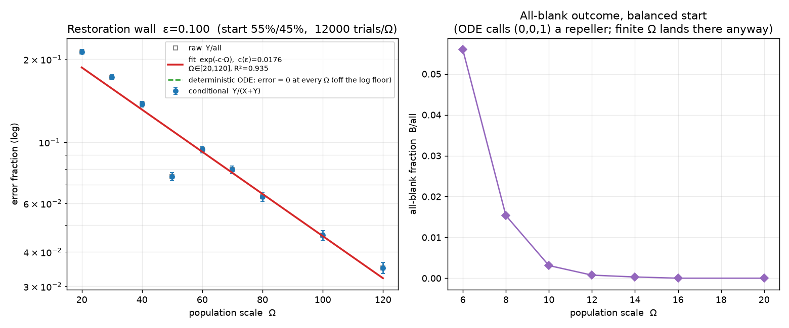

Left: the conditional error fraction `Y/(X+Y)` falls log-linearly with Ω, fitting
`exp(−c(ε)·Ω)` with measured **c(0.10) ≈ 0.018, R² ≈ 0.94**. The deterministic
ODE glides to the X rail every time — error exactly 0 at every Ω, off the log
floor: that curve is the lie. Right: the **all-blank** outcome, which the
deterministic view calls an impossible repeller, genuinely occurs at low Ω (~5%
at Ω=6) and vanishes as Ω grows — a pure finite-count effect with its own Ω
scaling.

```bash
python -m experiments.restoration_wall                 # default: eps=0.10, clean wall
python -m experiments.restoration_wall --trials 20000  # tighter statistics
python -m experiments.restoration_wall --bias 0.02     # the literal 51/49 (shows the crossover, not the wall — see note below)
python -m experiments.restoration_wall --quick         # fast smoke run
```

### The landscape — `experiments/phase_portrait.py`

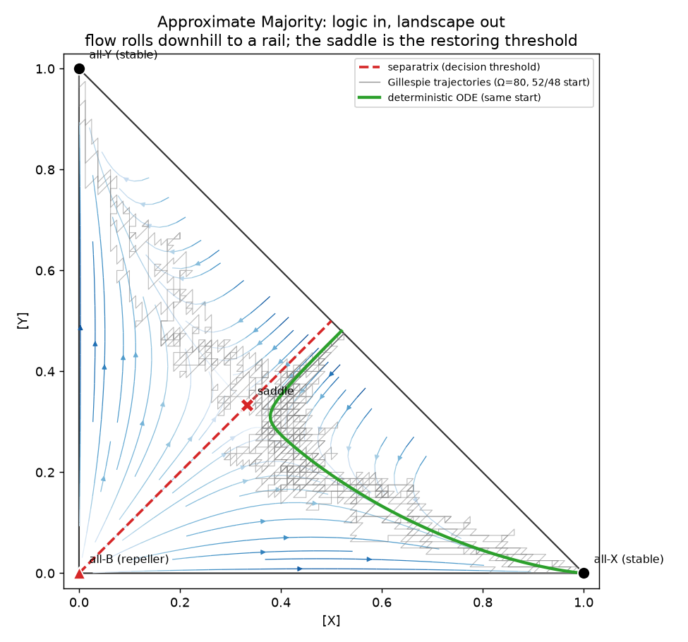

The deterministic flow (blue streamlines) rolls downhill to a rail; the red
diagonal is the separatrix (the restoring threshold); grey lines are exact
Gillespie trajectories fluctuating around the smooth green ODE from the same
start. The saddle's role as a threshold is *basin structure*, not a slogan.

```bash
python -m experiments.phase_portrait
```

## Why the default bias is 55/45, not 51/49

The design doc's illustrative 51/49 (ε = 0.02) has an *intrinsically tiny*
barrier: `c·Ω` stays below ~1 across the whole observable window, so the wall
never clears the algebraic-prefactor crossover until Ω reaches the thousands —
where errors collapse to ~e⁻²⁵ and every trial reads as correct (you measure
zero, not a small number). This is the squeeze §4 of the design doc warns about,
made concrete by actually running it. A slightly larger — still small — bias puts
a clean `exp(−c·Ω)` squarely in the accessible window. The experiment stays fully
parameterized by `--bias`, so 51/49 is one flag away; it simply shows the
crossover rather than the wall.

## Radix experiment (n-winner AM)

Generalizes AM to n committed symbols to measure **radix vs. margin** — the
project's core claim — as data.

- `experiments/radix_wall.py` — champion-vs-field. One symbol leads each rival by
  a fixed pairwise margin δ (55/45 at n=2). Measures the barrier `c(n)` and the
  population `Ω_required(n)` to hold a fixed reliability as the alphabet grows.
- `experiments/radix_discovery.py` — symmetric start. Characterizes the outcome
  distribution (single winner / all-blank / coexistence / undecided) and consensus
  time vs n, under fixed-total-Ω and fixed-density conventions — built to reveal
  high-n failure modes (blank collapse, long coexistence) rather than confirm a
  prediction. At the tested (n, Ω) grid the system stays robust (single-winner
  ≈ 1.0); the cost of radix shows up instead as a falling barrier c(n) and rising
  consensus time, not as collapse.

```bash
python -m experiments.radix_wall --quick
python -m experiments.radix_discovery --quick
```

**Is the penalty just a convention?** Partly — and testing it vindicated the
original choice. Under a fixed champion *share* the penalty vanishes outright
(P(win) = 1.000 at every n≥3), but that convention hands the champion a pairwise
lead growing 0.10 → 0.53, so it asks an easier question at every n. Fixed pairwise
margin is the convention that isolates alphabet size
(`experiments/radix_convention.py`, [`FINDINGS.md`](FINDINGS.md) §3.1).

The engine reaches n≈100 via a NumPy-vectorized SSA path (`crnl/vectorized.py`)
validated to match the readable reference propensities to 1e-12 (rtol), including
the boundary states where naive fast paths diverge.

## Scaling laws, theory, and expansion

Four further results; numbers and caveats in [`FINDINGS.md`](FINDINGS.md), raw data
in `results/`.

### Predicting the barrier — `experiments/quasipotential.py`

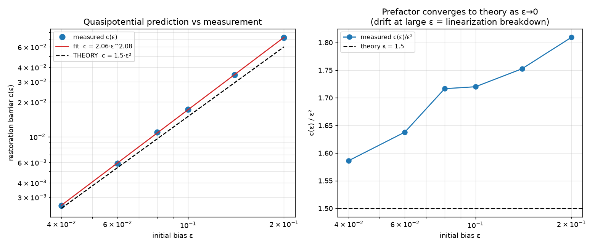

The barrier is *derived*, not fitted: reducing AM to its decision coordinate gives
an unstable direction with rate λ=⅓ and finite-count diffusion D=1/(9Ω), hence
**c(ε) = (3/2)·ε²** (`docs/design.md` §9). Measured exponent **2.08**, and the
prefactor descends toward the predicted 1.5 as ε→0 (**1.586** at ε=0.04) — a
first-principles prediction with no fitted parameters.

### Radix scaling — `experiments/radix_scaling.py`

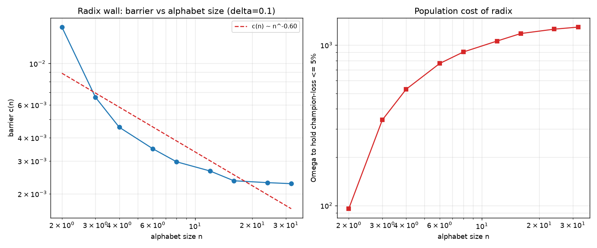

c(n) falls ~7× from n=2 to n=32 and then **saturates** at ≈0.0022 (confirmed to
n=64), while the population cost Ω_required rises ~13×. Under a fixed pairwise
margin the radix penalty on the *margin* is bounded; the price is paid in Ω.

### Freeze-out in an expanding volume — `experiments/expansion.py`, `experiments/freezeout_law.py`

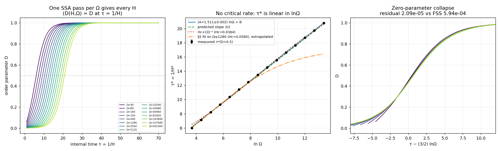

Let the volume expand as Ω(t)=Ω₀e^{Ht} and restoration must beat the dilution. Expand
fast enough and the decision **freezes half-made**, locking in a relic — the chemical
analogue of cosmological freeze-out.

**But "fast enough" is not a critical rate; it is a deadline, and an earlier claim
here was wrong.** This section
used to report a finite-size-scaling collapse with **Hc≈0.055, a≈0.38** and call it "a
genuine transition". The expanding SSA turns out to be *exactly* ordinary AM stopped at
internal time τ = 1/H — an exact time change, verified bit-for-bit — so H* is one over
the consensus time, which from a symmetric start diverges like **(3/2)·lnΩ**. Measured
over ×16384 in Ω, `dτ*/dlnΩ = 1.5005 ± 0.0023` against a parameter-free 3/2, H* passes
straight through 0.055, and a **zero-parameter** collapse beats the two-parameter one
by 28×. Start the same system with a fixed bias instead and a real Ω-independent
critical rate appears (H* = 0.2102, slope −0.0022 ± 0.0003) — so the drift read as
criticality was the shrinking shot-noise seed. FINDINGS §5.1.

Bigger alphabets still freeze *more* easily (`expansion_radix.py`: H* falls
0.121→0.071 across n=2→16) — and that table is reproduced to 1–3% by a *non*-expanding
SSA measuring nothing but consensus time.

### Deep cascades — `experiments/cascade.py`

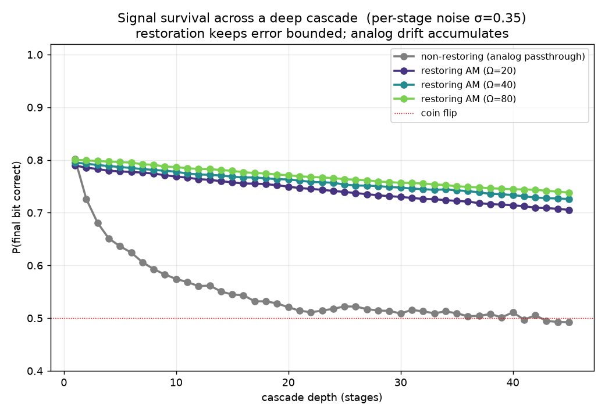

Why restoration matters at all: a non-restoring cascade decays to a coin flip by
depth ~22, while the restoring AM cascade still carries the bit at depth 45.
Restoration does not zero the per-stage error — it makes it exponentially small in
Ω, so survivable depth scales like e^{cΩ}.

```bash
python -m experiments.quasipotential --quick
python -m experiments.radix_scaling --quick
python -m experiments.freezeout_scaling --quick
python -m experiments.freezeout_law --quick
python -m experiments.expansion --quick
python -m experiments.cascade --quick
```

## What restoration costs in free energy

Every result above takes the project's founding thermodynamic claim on faith.
Irreversible AM has *formally infinite* dissipation — there is no number to
report — so pricing restoration meant rebuilding AM as a proper thermodynamic
CRN: every reaction reversible, all reverse rates scaled by one parameter γ.

    X + Y ⇌ 2B      B + X ⇌ 2X      B + Y ⇌ 2Y        (reverse rate = γ · forward)

Detailed balance needs `γ³ = 1`, so **every γ < 1 is genuinely driven**, and with
`rank(S) = 2` the cycle space is one-dimensional — the entire drive is a single
number, the cycle affinity `A(γ) = −3 ln γ`. γ→1 is equilibrium; γ→0 recovers the
irreversible AM used everywhere above. These three experiments are **exact**: the
chemical master equation solved by sparse linear algebra on the conserved simplex
(7381 states at Ω=120, 0.20 s), not sampled — no sampling error, and one solve
yields the whole first-passage field rather than one point. Its limit is honest and
recorded: at strong drive and large Ω the direct solve loses precision and those
points are dropped rather than fitted, and that is the same corner where SSA becomes
unaffordable, so **neither** instrument currently reaches it (see
[`FINDINGS.md`](FINDINGS.md) §9).

### A landscape has a minimum price — `experiments/reversible_landscape.py`

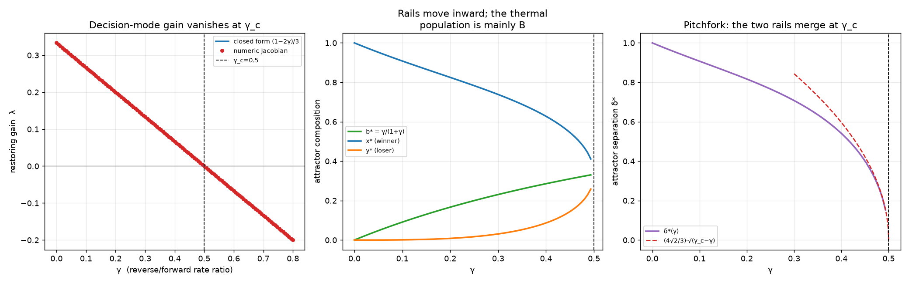

The symmetric point stays at (⅓,⅓,⅓) for every γ, and its decision mode has
`λ(γ) = (1−2γ)/3` — exactly the `+⅓` saddle eigenvalue of `docs/design.md` §2.3 at
γ=0, vanishing at

    γ_c = 1/2       A(γ_c) = 3·ln 2 = 2.0794

Below γ_c there are three fixed points; above it the rails have merged into the
symmetric point in a pitchfork (`δ* ∝ √(γ_c−γ)`), and **no population size Ω can
restore, because there is nothing to restore toward.** Bistability is not bought
with molecules; it is bought with affinity, and there is a hard floor on the
price. (`3 ln 2` is 3 reactions × ln 2 — the resemblance to Landauer is
arithmetic, not physics.)

### The cost of deciding — `experiments/dissipation_decision.py`

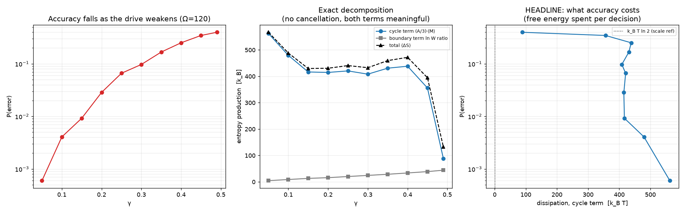

Entropy production is exact per jump, and for this network it also has a closed
form that splits the total cleanly into a boundary term and a cycle term. At
Ω=120, **4.3× more free energy buys 664× lower error** — but the exchange rate is
nowhere near constant: across γ ∈ [0.15, 0.40] the cost sits flat at **430–470
k_BT while the error varies 25×**. Raising γ makes each cycle cheaper but demands
more of them, and the two effects partly cancel. So "restoration costs
dissipation" is true; its naive monotone reading is not.

### The cost of remembering — `experiments/dissipation_memory.py`

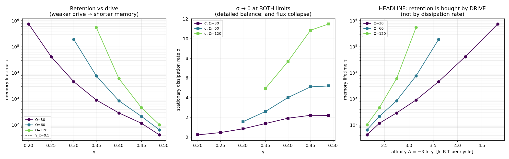

A decided state is only metastable at finite γ — the reverse reactions regenerate
blank and let the loser back in. Exact mean first-passage lifetimes show
**retention is exponentially sensitive to drive**: at Ω=30, raising A by 2.3×
buys 17,800× longer memory. But the steady dissipation *rate* σ → 0 in **both**
limits (γ=1 by detailed balance, γ→0 because the cycle flux collapses faster than
A grows), and σ and τ move in opposite directions across the bistable range. The
corrected claim: restoration requires a minimum **affinity**, not a minimum
dissipation rate. Deciding costs `O(Ω)·A` and every cascade stage pays again;
holding a decided state costs no power in the zero-leak limit.

### The price of a restoring stage — `experiments/dissipation_cascade.py`

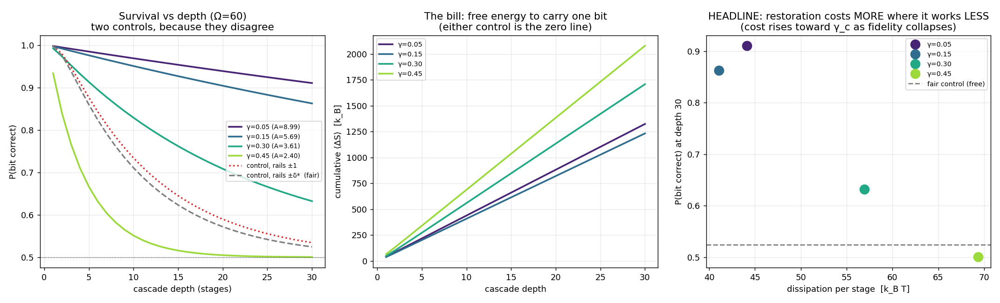

§7 showed *why* restoration matters but could not price it. Here a stage seeds a
fresh vessel from the previous stage's output, runs for a fixed time, and emits the
composition the chemistry actually reached — no threshold, no `sign()`, no
renormalization — with the cascade solved exactly as a matrix product. The result
is not that weak drive is cheap: **at Ω=120, 1.67× the free energy per stage buys a
total loss of function** (89.5 k_BT → fidelity 0.921 at γ=0.05, versus 149.1 k_BT →
0.502, a coin flip, at γ=0.45). Restoration degrades into paying more for nothing.

Every cell reports **two** control conventions, because an earlier headline
("restoration requires a minimum Ω") turned out to be a property of the comparator
rather than the chemistry and was withdrawn; the script flags the 1 of 12 cells
where the conventions still disagree instead of picking one.

### The cost of a bit, with no comparator — `experiments/bit_cost.py`

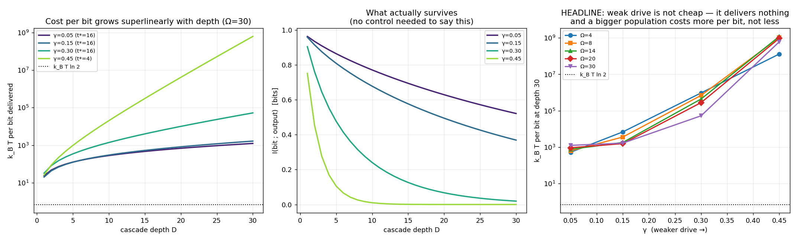

Every verdict above needs a control, and a control is a free parameter. This one
does not: measure the mutual information between the input bit and the depth-D
output, divide the cumulative dissipation by it, and report **k_BT per bit
delivered**. The cheapest bit measured is **1239 k_BT** (γ=0.05, Ω=30, depth 30) —
**1787× `k_B T ln 2`**, quoted as a scale comparison since Landauer bounds erasure
rather than transmission.

Two results invert the naive reading: **weak drive is not cheap, it delivers
nothing** (cost per bit diverges as γ→γ_c even though §9.3's dissipation *rate*
falls), and **reliability is bought superlinearly** — quadrupling Ω buys 21% more
information at 3.4× the price. Depth is part of the question: at depth 1 the measure
rewards a stage that does nothing, so the experiment refuses `--depth < 5`.

**Why there is no optimum** — `experiments/channel_wall.py`

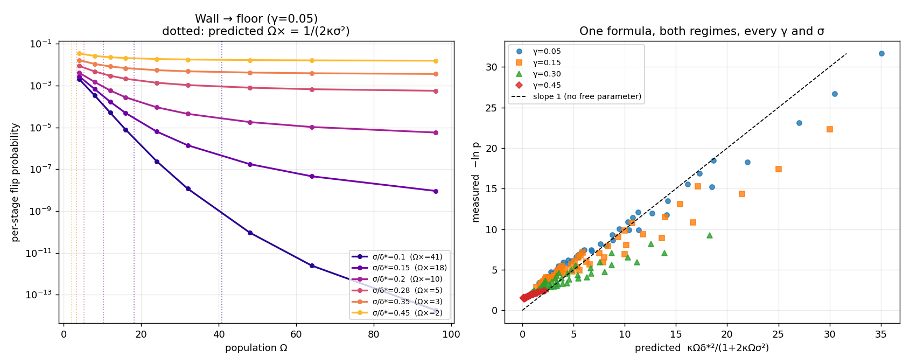

Because the protocol above sits on the wrong side of a crossover. A saddle point
over where a flip happens gives **one parameter-free formula** covering both
regimes — `−ln p ≈ κΩδ*²/(1+2κΩσ²)` — whose limits are §1–2's restoration wall
(`κΩδ*²`, exponential in Ω) and an Ω-independent channel floor (`δ*²/2σ²`). It
collapses **216 cells to R² = 0.960**, with the coefficient
`κ(γ) = λ(γ)/(2D₀(γ)) = (3/2)(1−2γ)/(1+γ)` — a restoring gain over a diffusion,
both taken at γ. §12 originally scaled the gain and left the noise at its γ=0
value (R² = 0.933); §15 measures κ against the exact quasipotential and against
first passage and corrects it. On the wall side the
per-stage flip probability falls **eleven orders of magnitude** with population; on
the floor side molecules buy nothing. Every cascade result here used σ_ch/δ* = 0.35,
which is on the floor side — which is *why* the frontier saturates.

Extending down to Ω=4 finds **no efficiency optimum** — cost per bit falls all the
way, because the ratio is minimized by a system that barely transmits (Ω=4 carries
0.12 bits). So the experiment reports an **efficient frontier** instead: cheapest
total ΔS for each level of information actually delivered. Along it the **marginal
cost of information rises 77×** — half a bit costs 646 k_BT, the next 0.11 bits cost
2000 more.

Full tables, the γ→0 caveat, the protocol trap that produced a convincing false
dissipation optimum, the two discarded Part C designs, and a withdrawn claim:
[`FINDINGS.md`](FINDINGS.md) §9–§11.

```bash
python -m experiments.reversible_landscape
python -m experiments.dissipation_decision --omega 60
python -m experiments.dissipation_memory --omegas 30 60
python -m experiments.dissipation_cascade --quick
python -m experiments.bit_cost --quick
```

## Asymmetric landscapes, and the one design rule

Every network above is symmetric under relabelling the symbols. Tilting the two
autocatalytic branches by `β` — each reverse still `γ×` its own forward, so the
cycle affinity stays `−3 ln γ` and the tilt costs no thermodynamic *force* — gives
a second axis, and three results.

There is a **fold at `β_c(γ)`** past which the network is monostable and answers X
whatever it is shown. It collapses from 0.998 to 0.050 across γ = 0.05 → 0.45, so
near the bifurcation a 5% rate mismatch destroys the device. The bias lives in the
**saddle**, not the attractors: at strong drive the attractors do not visibly move
at all while the basin boundary shifts by a third of the landscape width.

For a **symmetric source, `β = 0` is optimal**, and the penalty for tilt *grows*
with population — at `β = 0.95·β_c`, information retained falls from 50% at Ω=120
to 3.7% at Ω=400. This is the one place in the project where more molecules
reliably hurt.

For a **biased source it is not**, which gives the project's first statement about
how to *build* the chemistry rather than how it behaves:

> Tilt until the log-ratio of the two error probabilities matches the prior
> log-odds — `ln(e₋/e₊) ∝ ln(p/(1−p))`, measured at R² = 0.9999 with a
> predicted-zero intercept of 0.018.

**The proportionality constant is 1.** It reads 0.76 at Ω=200 — the finite-
population correction is `1 − 28·Ω^{−0.90}` — and reaches 0.946 by Ω=1000, where
the predicted-zero intercept is 0.0002. Getting there needed the measurement
reposed: `dI/dβ = 0` is a root find in the prior, not an optimisation over β, which
is ~20× cheaper and bought a 10× population lever. The optimal tilt is gentle
(`β*/β_c` = 0.016–0.114) and the realisable gain is 0.5–16%, well below the
asymptotic promise.

**And who survives an annihilation.** `X + Y → 2B` is matter meeting antimatter,
so a tilted AM in an expanding volume has all three of Sakharov's ingredients.
From an exactly symmetric start the surviving species is set by the tilt above
`β√Ω ≈ 0.82` and by chance below it, with `P(X) = Φ(u)` parameter-free to under
1%. The decisive asymmetry *shrinks* as `Ω^{−1/2}` — a bigger system needs a
smaller bias to have a determined outcome. Under an expansion deadline the relics
that do form are *more* purely tilt-aligned, not less (0.958 against Φ = 0.841,
11σ), because surviving the deadline selects for the trajectories the tilt sped
up. The autocatalysis has no cosmological counterpart, so this is not
baryogenesis — it is what changes when an asymmetry runs through a *restoring*
landscape instead of a passive one.

Also here: a wall coefficient corrected after being carried to `γ > 0` with its
gain scaled and its noise left behind, two predictions of mine that were wrong,
and a harness bug that made a symmetric channel look asymmetric.
[`FINDINGS.md`](FINDINGS.md) §15–§18.

## What the model was missing: a temperature

Every AM reaction is 2→2, so dilution scales every propensity identically and the
ratios never move — `γ`, `δ*`, `κ`, `β`, `γ_c` are all invariant under expansion.
**The landscape was frozen and only the clock slowed**, which is *why* §5.1's
expanding SSA reduced exactly to ordinary SSA stopped at internal time `1/H`. In
this rig, expanding the volume and slowing down time were literally the same
operation — so there was no relic *abundance* to measure, only a relic sign.

Letting the medium cool (`γ(s) = γ₀^((1−s)^(−w))`, forward rates untouched) breaks
that. The drive profile is universal in `s = Hτ`, so H decides only how many
reactions fit inside the sweep from `γ₀` down through `γ_c` to zero — cooling
deepens the landscape while dilution starves it. At `w = 0` the new integrator
reproduces the old one **0/300**, state-for-state.

The payoff is the observable the fixed-drive model structurally could not have.
Starting *above* `γ_c` so there is no landscape at all, cooling drives the
pitchfork and the system must choose; conditioned on deciding, the relic minority
abundance rises **290× over a 4× range in H** and sits **10⁵–10⁸ above** the
equilibrium value at the drive it froze at — while the fixed-drive arm is flat
over the same range and simply *equals* equilibrium. **Abundance set by expansion
versus abundance set by chemistry.**

This does not overturn §5.1's `Hc = 0` — that argument survives any `γ(t)` — but it
scopes its reduction to uniform-order kinetics. [`FINDINGS.md`](FINDINGS.md) §19.

```bash
python -m experiments.cooling_relic --hubbles 0.005 0.01 0.02
```

## The last free lunch: a drive that can run out

`γ` was a free parameter held fixed forever — an infinite reservoir, set once and
maintained at no cost. So §9 measured what restoration *dissipates* while nothing
ever ran down, and §12.1's depth ceiling was purely noise-limited. Making the fuel
a reactant (`X + Y + F → 2B + W`, and so on) gives `γ_eff = γ∞·w/f`, which **rises**
as the tank empties. `n_F` is a genuinely independent coordinate — a full cycle
returns X, Y, B exactly to their start while burning three fuel — so the fixed-γ
model is a *projection* that discards a coordinate which must exist.

**There is a second ceiling, and it has a different shape.** The fuel-limited
memory lifetime is **flat in Ω** (spread 1.08× and 1.16× over a 6× population
range, at two fuel concentrations) while the noise-limited lifetime on the same
clock is `exp(0.12·Ω)`, R² = 0.984. They cross at Ω ≈ 3–8, and by Ω = 180 the noise
ceiling is 10⁹× further away. **Above a population of about ten, restoration is
fuel-limited and more molecules buy nothing** — the exact mirror of the restoration
wall above, where molecules bought exponential reliability.

Two counterintuitive results came with it: **more fuel gives a *shorter* lifetime**
(the fractional burn rate is fuel-independent, so a bigger tank buys no extra
runway and only makes the chemistry track its own collapse more faithfully), and
**the bit outlives the drive's death by 7–37%** — I predicted the opposite sign,
having reasoned about the barrier degrading but not about the state still needing
to relax once it vanishes. [`FINDINGS.md`](FINDINGS.md) §20.

```bash
python -m experiments.fuel_ceiling --omegas 30 60 120 --fuel-concs 10 --trials 60
```

```bash
python -m experiments.wall_coefficient_exact
python -m experiments.asymmetric_landscape --part fold
python -m experiments.biased_source
python -m experiments.tilt_rule_limit --omegas 100 200 400
python -m experiments.relic_asymmetry
```

## What a simulation is allowed to throw away

CRNL's method has always been a two-point version of this — ODE against exact SSA,
and the gap is the subject. Filling in the levels between (chemical Langevin,
tau-leaping) and scoring all of them against an exact CME splitting probability
gives a sharper answer than expected: **it is a cliff, not a slope.**

Every level that keeps *any* noise recovers the restoration error exponent to
within about ten percent — the CLE with real-valued counts and Gaussian noise,
tau-leaping with windowed Poisson firings, and the exact SSA are all in one class.
The ODE, keeping none, reports **exactly zero** in every cell where the truth spans
1.5e-3 to 1.6e-1, and has no refinement parameter that improves it. So the
discreteness, the exact jump timing and the correct jump distribution are all
discardable for this observable; **having noise at all is not.** Checked at n = 2
and again at n = 3, where it survives.

The corollary is about cost: a cheap SDE gets the exponent, and the expensive
exactness (O(Ω) events for the SSA, O(Ω²) memory for the CME) buys the *prefactor*
and the individual probabilities. A simulation that needs to know how fast
reliability grows with population can be cheap; one that needs the actual failure
rate cannot.

Why this is not a numerics exercise: Kurtz's theorem licenses the ODE limit on
finite time intervals, and §5.1 leans on it. It is true, and it does not cover this
observable, because restoration lives in tails where the convergence is not
uniform. **A limit theorem cannot tell you what your simulation may throw away.**
[`FINDINGS.md`](FINDINGS.md) §21.

```bash
python -m experiments.approximation_hierarchy --omegas 40 70 100 --trials 2000
python -m experiments.verify_base            # re-derives the published closed forms
```

## Where noise has to be, and why the answer is a theorem

§24 split AM's noise into the signal coordinate `δ = n_X − n_Y` and the bookkeeping
pool, keeping the full drift in every arm and projecting only the noise. Deleting
the *signal* noise while keeping **88% of the total variance** gives `P(error) = 0`
in every cell — the ODE's own failure. Keeping 11% in the signal alone recovers the
answer to 2–18%. Placement beats amplitude, and by a wide margin.

**The zero turned out to be a theorem, not a measurement.** For every n, every γ,
and every pair of committed species,

    d(n_i − n_j)/dt = (n_i − n_j) · (k/Ω) · [ n_B − Σ_{l≠i,j} n_l − γ(n_i + n_j − 1) ]

verified against the network's own stoichiometry at n = 2…6 over 4,600 pairs to a
worst residual of **4.4×10⁻¹⁶**. The drift carries no additive term, so **sign(n_i −
n_j) is conserved once that difference direction is starved of noise** — no number
of trajectories could ever have found a crossing. Demonstrated where it cannot be
barrier height: a champion ahead by a *single count*, exact error 0.597, full noise
failing 59.9% of the time, and the arm still exactly 0 in 40,000 trajectories.

That bounds what the result may claim, so it was tested where the structure breaks.
`am_asymmetric` carries an additive term that vanishes identically at β = 0; at a
barrier held to 7.1% and with the retained variance **constant at 0.891 to three
decimals**, the categorical zero becomes 3.2%. Amplitude fixed, drift structure the
only variable. [`FINDINGS.md`](FINDINGS.md) §24, §29–§31.

## Restoration is not error correction, and the difference is nameable

AM is a majority-vote restoring circuit; quantum error correction is redundancy plus
syndrome extraction. Both restore. Running the comparison honestly required the
voting to be *chemistry* — k tanks physically combined into one k·Ω tank that carries
its own noise, never a `sign()` in the harness — and it produced a two-sided answer.

One-shot, voting **loses to pooling** the same molecules, 9 cells in 10, by a factor
growing exponentially: `p₀ ~ exp(−Ωc)` makes voting `3p₀² ~ exp(−2Ωc)` against
pooling's `exp(−3Ωc)`. **Voting squares the error; pooling cubes the exponent.** The
predicted slope of `ln(p_vote/p_pool)` is the collapse rate itself, and it lands
within **1.4%** of `−2·V_exact` from §15's closed forms.

Time-extended, the answer reverses in a bounded window: periodic re-merging beats a
single tank by up to **5×** while burning 29% less — but only below a crossover in Ω
and only when cycling is fast, and the crossover has a closed form predictable from
two numbers measured on the *hold* protocol alone (k-independent to 3–4%, and
accurate to 0.12% once the Kramers prefactor is included).

**So the contrast with QEC is not that concatenation fails here.** In QEC the
physical error rate is fixed, so concatenation's advantage grows without bound below
threshold. Here the error rate itself falls exponentially in Ω, so re-merging's
advantage occupies a finite window and then reverses — **chemistry has a knob QEC
lacks, and the code wins only until that knob is turned far enough.**
[`FINDINGS.md`](FINDINGS.md) §32–§34.

## Reaching the founding regime

The project is about a switch that errs at 1e-15. Every number it could measure sat
between 1e-1 and 1e-2, and `THEORIES.md` named that as the binding constraint:
*large Ω and small probability is reachable by neither instrument.*

**The probability half of that was an implementation artifact.** The error was
computed as `1 − split` — a difference of two numbers near 1 — which dies to
catastrophic cancellation near 1e-12. Naming the *wrong* outcome as the favoured set
solves for the small number directly, with no subtraction anywhere:

    P(error) = 6.354802e-33   at Ω = 2000, exact, in 115 s

Twenty-five orders below anything previously measured here, through the founding
claim's own regime. Validated three ways: identical to the old route to 7–8 digits
across the whole overlap; a **componentwise** correction of 1.0×10⁻¹³ at h = 6.35×10⁻³³
(a norm residual is dominated by the large components and would not notice a garbage
small one); and it is the M-matrix property — the LU solve carries no subtractive
cancellation, so relative accuracy survives to arbitrarily small values.

**The first thing it showed was that a headline of ours was an artifact.** With 29
decades instead of 6.5, the local slope visibly drifts, so `P ~ A(Ω)·exp(−cΩ)` and
every collapse slope published here is a finite-Ω *effective* slope. Against §15's
closed form the asymptotic disagreement is **7.5–15.5%**, not the 0.4–11% measured on
a four-decade window — and the "closest agreement in the project", 0.4% at γ = 0.35,
is an **18.7× understatement**. The agreement was most flattering exactly where the
window was shallowest. [`FINDINGS.md`](FINDINGS.md) §35.

```bash
python -m experiments.deep_tail          # the collapse to 1e-33, with the accuracy audit
python -m experiments.pairwise_identity  # the identity, and what it does and does not cover
python -m experiments.concatenation      # voting against pooling, everything exact
```

## What a restoring element *is* — the Symmetric Restoration Theorem

For any mass-action network symmetric under exchanging two species, the drift of the
lead `n_X − n_Y` factors exactly, so the diagonal is invariant: **the sign of a lead
is a deterministic invariant and every reversal is a fluctuation.** The amplification
decomposes as

    P(x) = Σ_r  c_r · d_r · B_r(x),    d_r = S_X(r) − S_Y(r) ∈ ℤ,    B_r(x) ≥ 0

with every bracket nonnegative and `d_r` fixed by **stoichiometry alone**. Two
consequences: **capability is combinatorial** — the network can restore for *some*
rates iff some `d_r > 0` — and **realisation is one linear inequality** at the
symmetric steady state, which reproduces AM's `γ_c = 1/2` to **1.1e−15** and agrees
with the ODE on **120/120** networks. The realising set is a cone but is **not
convex**: two restoring rate vectors can sum to a non-restoring one, inside AM's own
family. [`FINDINGS.md`](FINDINGS.md) §54, §56, §62, §65.

**Prior art, checked late and honestly.** The invariance is a folk theorem of
equivariant dynamics; the realisation criterion is Theorem 1 of Montoya, Cruz & Ágreda
(2019) in the homochirality literature, stated there more generally. What was not
found there is the sign decomposition and the combinatorial criterion — and *"not
found in two papers"* is weaker than *"novel"*. **This project claims priority for
nothing.**

## Reliability has no thermodynamic price, and the sharpest closure runs both ways

The natural hope is an exact relation between error rate and dissipation. It was
pursued five ways and closed each time. The fifth is the one that counts, because the
first four priced quantities later shown not to govern anything.

Both networks have a **one-dimensional cycle space**, so the entire non-equilibrium
drive is a single number that can be pinned by construction while the kinetics move:

> With the affinity held fixed to **4.9e−14 nats**, the escape action spans a factor
> of **926**. With the action held fixed to **0.0000%**, the affinity spans **0.92
> nats**.

Neither implication holds — the drive does not set the action, and the action does not
report the drive. Earlier closures established only the first direction.
[`FINDINGS.md`](FINDINGS.md) §82.

## The exponent that governs reliability, and computing it without a master equation

An element in a cascade can misread its input *or* spontaneously escape its rail.
Both are exponential in Ω, so the smaller exponent wins outright — and **escape beats
readout by e⁴³²**. Five sections had priced the subdominant mode (§80).

The escape action turns out to be computable from the rate functions alone. Writing
the WKB Hamiltonian and sending the *fast* Hamiltonian flow to its fixed point gives
a prediction with **no master equation, no stationary solve, no lattice and no Ω** —
validated against exact CME first-passage times over eight γ and ten (γ, M) cells, and
corrected by the fast-pair term the reduction drops. §64's standing verdict —
*"ν ≈ 2 ± 0.1, not determined more precisely by any instrument here"* — became a
quadrature. [`FINDINGS.md`](FINDINGS.md) §80, §84–§89.

> ⚠ And then §90 withdrew the precision. Varying the extrapolation ansatz spreads the
> *measured* action by up to **0.407%**, and the candidates straddle the theory value:
> the residual was below the resolution of the instrument that would test it. The
> agreement stands to within the measurement's own resolution; the quoted ± did not.

## Composition — and it is not a property of the element

The founding claim is about *cascades*. Every cascade here coupled stages through a
Gaussian readout channel with σ imposed by hand; the chemically-coupled chain — where
stage i's output *species* is stage i+1's input, with no readout — was never built.
Building it gave three couplings, **all exactly neutral at the rail** (each reproduces
the isolated element when the upstream is correct), using the same element, the same
rails and the same Ω:

| coupling | transmits? | noise margin | per-stage error vs isolated |
|---|---|---|---|
| drives the influx | **no** | — | 1.06–1.09 |
| drives the autocatalysis | yes | **0.88 σ** | **17.7 – 63.5** |
| saturating (Hill) | yes | **3.39 σ** | 1.71 – 2.29 |

The **noise margin** — the upstream drop at which the downstream loses its high rail,
in units of the upstream rail width — controls it, with `log(penalty) ≈ −0.95 ×
margin/σ` and two independent knobs collapsing onto one curve. A second control then
appeared: scaling the upstream's rates leaves its landscape, barrier, rail width and
stationary law *identical* and changes only its clock, and the penalty moves **2.7×** —
plateauing for a slow upstream and falling by **motional narrowing** above
`τ_up = τ_down`, exactly where the upstream's correlation time meets the downstream's
response time.

> **Composition is a function of two numbers — the noise margin and the timescale
> ratio — and both are properties of single elements.** The joint master equation
> validates that; it is not needed to compute it. **A cascade is safest when its
> upstream stages are fast and its transfer function saturates** — and neither is a
> property of the restoring element itself, which is what a transistor's saturating
> gain curve supplies. [`FINDINGS.md`](FINDINGS.md) §91–§93.

**The near-miss is the instructive part.** The first version of that experiment gated
only *neutrality* and found error accumulation strongly **sublinear** — an added stage
costing 0.095 of an isolated element's error, reading exactly as restoration filtering
errors, the founding claim confirmed. The exact joint law gave
`P(stage 2 low | stage 1 low) = 0.0017`: the flip never propagated. **"Error does not
accumulate" was true because nothing was connected.** A neutrality gate tests only the
null condition; a cascade must also *transmit*.

```bash
python -m experiments.chemical_cascade   # three couplings, and the transmission gate
python -m experiments.margin_law         # frozen vs fast averaging, motional narrowing
python -m experiments.timescale_ratio    # the crossover at tau_up = tau_down
```

## Verifying the base

`experiments/verify_base.py` re-derives 26 load-bearing closed forms from the
current code and checks them against their published values, and runs as part of
the suite. The tests prove the code is self-consistent with itself; the audit
proves it still agrees with what is written down — a different question, and the
one that rots silently when a behavioural function changes underneath sections
already published (§15 changed the wall coefficient). All 26 currently agree.

## License

Apache License 2.0 — see [LICENSE](LICENSE) and [NOTICE](NOTICE).

Apache 2.0 rather than MIT for two reasons specific to this work. It carries an
**explicit patent grant** with defensive termination (§3), which matters in
molecular and chemical computing where MIT's silence on patents leaves a real
ambiguity for anyone building a physical implementation from these results. And
§4(b) requires a modified version to state that it changed the files — which
matters here because much of the repo is a *measurement record* with corrections
and withdrawn claims in it, and a fork's numbers should not be mistaken for these.

Consistent with the author's other public work: KernRift and EIR carry the same
licence and a NOTICE.

Citing it: [CITATION.cff](CITATION.cff).

## Setup

Requires Python 3.10+.

```bash
python -m venv .venv && source .venv/bin/activate
pip install -r requirements.txt
```

## Verify (the physics checks are the tests)

```bash
pytest -q
```

The suite verifies each build stage: AM's stoichiometry is conservative; the RHS
matches the reduced ODEs; the fixed-point eigenvalues reproduce §2.3 exactly
(−1,−1 rails; −1,+⅓ saddle; +1,+1 repeller); the homodimer and heterobimolecular
units conventions are correct; **the SSA converges to the ODE as Ω grows** (the
single best test that the units convention is right); every AM trajectory absorbs
into one of three bins including all-blank; and seeded trajectories replay
exactly.

## Layout

| Path | Role |
|------|------|
| `crnl/reactions.py` | species/reaction data model; builds S; **owns the units convention and propensity builder** (§3.2, §3.3) |
| `crnl/deterministic.py` | scipy LSODA path; `S·v(x)`; analytic Jacobian; conservation monitoring |
| `crnl/stochastic.py` | hand-written Gillespie SSA — the lesson |
| `crnl/classify.py` | absorption test + dwelling test + fixed-point classifier (stoichiometric-subspace aware) |
| `crnl/networks/am.py` | AM as data: 3 species, 3 reactions, k=1 |
| `crnl/networks/n_winner_reversible.py` | reversible n-winner AM: symmetric state, symmetry-breaking eigenvalue, and the critical drive gamma_c(n) |
| `crnl/networks/n_winner.py` | n-winner AM as data: n committed species + blank, pairwise disagreement + per-species autocatalysis |
| `crnl/vectorized.py` | NumPy-vectorized SSA path validated against the reference propensities, letting the radix experiments reach n≈100 |
| `crnl/networks/am_reversible.py` | reversible AM as data: γ-scaled reverse rates, derived reverse pairing, cycle affinity from the null space, closed-form fixed points and γ_c |
| `crnl/thermo.py` | stochastic thermodynamics primitives: per-jump entropy production, the boundary/cycle decomposition (the only place the A/3 factor lives), and the instrumented SSA loop with its integer counter and flip trigger |
| `crnl/cme.py` | exact chemical master equation on the conserved simplex — generator, stationary distribution, dissipation rate, first-passage times and splitting probabilities by sparse solve |
| `crnl/cascade_exact.py` | exact per-stage cascade kernel (augmented generator, two alphabets) and the passive control whose dynamic range is an explicit axis |
| `crnl/information.py` | mutual information of the delivered bit, the comparator-free cost-per-bit measure, and the saddle-point wall/floor prediction |
| `experiments/restoration_wall.py` | the §4 protocol |
| `experiments/phase_portrait.py` | the §2.3 landscape, made visible |
| `experiments/radix_wall.py` | champion-vs-field barrier c(n) and population cost Ω_required(n) as the alphabet grows |
| `experiments/radix_discovery.py` | symmetric-start outcome distribution and consensus time vs alphabet size |
| `experiments/n_winner_affinity.py` | minimum affinity for an n-symbol landscape: gamma_c(n) and A_c(n) |
| `experiments/radix_convention.py` | fixed pairwise margin vs fixed champion share — which convention actually isolates alphabet size |
| `crnl/expanding.py` | exact SSA in an exponentially expanding volume; freeze-out |
| `crnl/freezeout.py` | the time change that makes expansion a finite internal-time budget: cross-trial SSA sampled on an internal clock, exact AM CME generator, and the deterministic route |
| `experiments/freezeout_law.py` | is there a critical expansion rate? Ω to 655 360, log law vs power law, and the biased-start control |
| `experiments/radix_scaling.py` | adaptive per-n sweep giving the c(n) scaling law and Ω_required(n) |
| `experiments/quasipotential.py` | derives c(ε)=(3/2)ε² from the saddle and tests it against data |
| `experiments/expansion.py` | freeze-out transition, relic abundance, frozen compositions |
| `experiments/freezeout_scaling.py` | finite-size-scaling collapse: is freeze-out a real transition? |
| `experiments/expansion_radix.py` | freeze-out vs alphabet size — bigger alphabets freeze easier |
| `experiments/cascade.py` | signal survival across a deep cascade, restoring vs non-restoring |
| `experiments/reversible_landscape.py` | the pitchfork at γ_c = 1/2: bistability vs drive, and the minimum affinity a landscape costs |
| `experiments/dissipation_decision.py` | exact free-energy cost of *deciding* vs error probability, split into boundary and cycle terms |
| `experiments/dissipation_memory.py` | exact lifetime τ and dissipation rate σ of a decided state — the cost of *remembering* |
| `experiments/dissipation_cascade.py` | the price of a restoring stage vs a passive channel, reported under two control conventions |
| `experiments/bit_cost.py` | k_BT per bit delivered to depth D — no control, no rail convention |
| `experiments/channel_wall.py` | the crossover from restoration wall to channel floor, against a parameter-free prediction |
| `experiments/approximation_hierarchy.py` | ODE / CLE / tau-leap / SSA against the exact CME — what a simulation may throw away (§21) |
| `experiments/noise_placement.py` | noise projected onto the signal vs the pool: placement against amplitude (§24) |
| `experiments/pairwise_identity.py` | the pairwise multiplicative identity, and which projections it does and does not cover (§30) |
| `experiments/rival_erosion.py`, `experiments/rival_bracket_scan.py` | the champion-margin sink, and the sweep that broke its confound in the opposite direction (§30.1–§30.2) |
| `experiments/additive_term.py` | a network whose drift carries an additive term — where the categorical zero breaks (§31) |
| `experiments/concatenation.py` | pool-merge voting against pooling the same molecules, exact throughout (§32) |
| `experiments/remerge_hold.py` | periodic re-merging against the single-tank hold, at matched molecules and accounted dissipation (§33) |
| `experiments/crossover_law.py` | closed form for the crossover, tested against data that never entered the fit (§34) |
| `experiments/deep_tail.py` | the collapse solved directly to 1e-33, with the componentwise accuracy audit (§35) |
| `experiments/collapse_slope_absolute.py`, `collapse_slope_grid.py` | the closed form tested in absolute terms, on self-calibrating matched grids (§28) |
| `mlrift/` | exact SSA and projected-noise CLE in MLRift — native code, gated against the exact CME, 18x/core (§26) |
| `results/` | raw JSON behind every figure and table in FINDINGS.md |
| `FINDINGS.md` | all measured results, with caveats |
| `THEORIES.md` | live conjectures with falsifiable predictions, open questions with their kill tests, and the catalogue of confident wrong results kept with what killed each one |
| `tests/test_engine.py` | the verification suite |
| `tests/test_n_winner.py` | n-winner network construction and stoichiometry checks |
| `tests/test_radix_experiments.py` | radix_wall / radix_discovery helper and fit checks |
| `tests/test_n_winner_reversible.py` | n=2 reduction to the known closed form, cycle dimension C(n,2), and the bifurcation |
| `tests/test_radix_convention.py` | what each radix convention holds fixed, and the strict-lead guard |
| `tests/test_am_reversible.py` | reversible network construction, reverse pairing, affinity, γ_c and the fixed-point branch |
| `tests/test_thermo.py` | per-jump entropy production against the closed form, and the decomposition identity |
| `tests/test_cme.py` | exact-solver checks: stationarity, detailed balance at γ=1 (σ=0), first-passage residuals |
| `tests/test_thermo_ssa.py` | instrumented SSA: bit-for-bit identity with `gillespie_fast`, counter vs the exact ⟨M⟩, flip hysteresis, reversible SSA→ODE |
| `tests/test_thermo_laws.py` | detailed balance and the second law in the forms that survive measurement (both naive statements are false) |
| `tests/test_cascade_exact.py` | cascade kernel invariants — the parity trap, the exact ⟨M⟩ oracle, and a regression guard on the withdrawn minimum-Ω claim |
| `tests/test_information.py` | information primitives, the cost-per-bit scalings, and a guard on the depth-1 degeneracy |
| `tests/test_channel_wall.py` | both limits of the saddle-point formula, the measured collapse, and the regime where it fits for the wrong reason |
| `tests/test_freezeout.py` | the expanding-SSA-is-a-clock reduction, bit-for-bit; the fast instrument against the reference engine and against the exact CME; and both logarithms of the (3/2)lnΩ law |
| `docs/design.md` | full design rationale |

The engine is general: it takes species, reactions, and rate constants and
derives both dynamics from that same data. AM is the first network loaded into
the engine — it is not the engine. n-winner AM / the radix experiment is now
implemented (see the Radix experiment section above and
`experiments/radix_wall.py` / `radix_discovery.py`). Both extensions sketched as
out-of-scope-for-v1 at the end of `docs/design.md` are now built: the analytic
saddle height (`quasipotential.py`) and free-energy accounting (`crnl/thermo.py`,
`crnl/cme.py`). What remains open is listed at the end of
[`FINDINGS.md`](FINDINGS.md).
